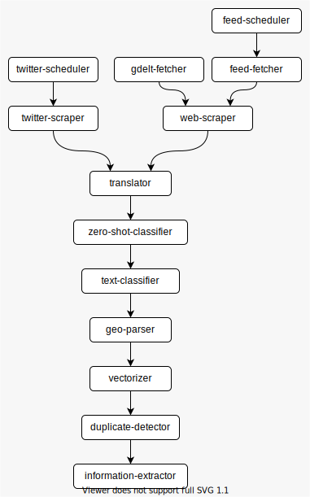

# WhatsNew

[](CODE_OF_CONDUCT.md) 

A simple tool to collect and process quite a few Web news from multiple sources.

## Overview

*WhatsNew* is a tool written in Go which allows the definition and execution of
pipelines for fetching news articles from the Web and processing them with
various automated tools.

It's highly modular and customizable, and it comes with a standalone executable
for running a predefined pipeline.

The default pipeline consists of a set of initial modules, or units, to fetch
news articles from different Web sources: Atom/RSS feeds, Twitter, GDELT
Project. The articles are normalized to a common representation, then they
pass through a series of data-processing units.

The predefined data processing steps include various automated tasks, mostly
powered by machine learning algorithms, such as: translation, different kinds
of text classification, named entity extraction and geoparsing, text
vectorization and duplicate detection, information extraction.

Many data processing units make use of services provided by the
[spaGO](https://github.com/nlpodyssey/spago) project, backed by publicly
available machine learning models.

Different steps provide various degrees of customization. You can run only
the parts of the system that you need, and you can write your own modules too.

The following diagram illustrates *WhatsNew*'s architecture on a broad level.
It represents the units of the predefined pipeline, together with other most
relevant services and components, also showing some interactions between
them.


The next image shows the fetching and processing data flow of the default
pipeline:



The rest of this document is all about making sense out of those charts.

## A more detailed overview

In the big picture, *WhatsNew* is a set of design decisions describing an
optionally distributed system for collecting news articles from different
Web sources and performing automated content analysis over them.

That might sound quite generic and abstract, but that's exactly the point.
At least in principle, we, the authors, don't want to put too many constraints 
on which specific subsystems and technologies to use, and we especially want
to keep maximum flexibility for the definition of the content analysis tasks.

More pragmatically, we chose a couple of essential components (namely, a
database and a background job processing system) and defined a minimal
set of entities (i.e. data structures stored on the database and exchanged
between different jobs) for supporting those generic goals.

Then, we crafted some code, which happens to be in Go (golang). It can be
considered a sort of "reference implementation" for collecting and
analyzing news articles. It follows an opinionated, yet flexible,
fetch-and-analyze pipeline that we find especially useful for many
practical use cases.

*WhatsNew* is highly modular.
The implemented functionalities come with various degrees of customization.
You can use the whole implementation as it is, or as many or as few parts
of it, just as it fits your needs.

Of course, you might need to perform specific tasks for manipulating or
analyzing your data, which are not included in this implementation.
If so, you can easily extend the system.

You can freely define new entities and allow them to refer to the existing ones,
without fear of breaking the existing parts.
You can also write your own code, virtually in any programming language,
and make it perform the desired duties when needed.
Or you can go as far as re-implementing some parts, or even the whole
system, in another language, if that's what you need.

## Motivation

Over the span of many years, whether it was for fun or profit, we found
ourselves countless times in need of a system capable of doing two
things:

1. periodically fetching frequently-updated content from various Web sources,
   mostly textual news articles from feeds, content aggregators or social
   media;
2. performing various automated analysis tasks over the content, as soon as it
   is fetched, usually involving machine-learning components.

The desired requirements for the first point haven't changed too much in time.
It might involve crawling the content of some Web pages to get the clean text of
an article, or there might be the need for fetching data from specific APIs.
But, all in all, after a reasonable effort, there we got some content.

The second point is more vague and demanding. Sometimes we just want to
run short-lived experiments for testing a piece of software on our local
machine. On other occasions, we need a stable distributed system running
24/7, fetching and processing large amounts of news.

Occasionally, a single piece of software is able to perform the desired
analysis (natural language processing, parsing, text categorization,
sentiment analysis, ...). More often, it's necessary to run
separate analysis processes, either concurrently or following a
specific order.

In any case, leaving aside the specific responsibility of each component,
we are just looking for a generic system or framework acting
like a "glue", putting all those parts together.

We evaluated various existing solutions, but none of them is working
well for us. Don't read us wrong: there are plenty of clever and valuable
tools out there! Yet, some of them are solving only a part of the whole
problem. Other projects are well-capable, but just too big, too complex,
or just painful to configure.

Being frequently out of time (and sometimes out of frustration), too often
we relied upon a jumble of improvised scripts and cron jobs. After many
trials and errors, we started recognizing some recurring patterns, which
allowed us to clear our heads and clean up our code.

Eventually, we collected all the good parts together into a single
coherent project. It is loosely modeled on our recurrent needs, but stays
flexible for expansions and modifications.

We hope you can find it useful too!

## How it works

The design's core concept is the definition of different executable **units**,
or **modules**. Each of them is generically intended as a piece of executable
code which performs a specific operation.

In the spirit of the Unix philosophy, we consider good practice keeping each
unit as small and focused as possible. For example, one unit can be
responsible for extracting the text content from a single Web page and store it
somewhere, while another unit might read the extracted content to perform
an automated text classification algorithm and store the result.

Each unit's execution might expect an input and produce an output, in a form
or another. Most notably, a unit can also trigger the execution of one or
more other units. This virtually allows the implicit definition of execution
**pipelines**.

*WhatsNew* is released with a predefined set of units defining a pipeline
for fetching textual news articles from different Web sources and performing
various analysis operations on their content. In order to do this, we obviously
had to make some implementation choices, where we tried to leave a great margin
of flexibility.

For managing the execution of different units, we chose a background
job processing system: [Faktory](https://contribsys.com/faktory/).
The open-source version is enough for running the default *WhatsNew*
implementation.
You can find good documentation on the 
[Faktory Wiki](https://github.com/contribsys/faktory/wiki).
In The rest of this document we'll take for granted that at least the basic
concepts are well known and understood.

Most of the predefined units of this project are just Faktory **workers**,
which are able to execute specific **jobs**.

Of course, there must be a starting point somewhere, an initial trigger.
Some units are simple commands, which can be executed manually, just once, or
periodically, like cron jobs. While able to trigger new Faktory jobs,
these units are not themselves workers. We define these simpler units
**tasks**.

You can find the implementation for the available tasks and workers under
`pkg/tasks` and `pkg/workers`.

Tasks and workers must read and write data, somehow. For this we use
a [PostgreSQL](https://www.postgresql.org/) relational database.

A set of domain-specific **entities** is defined as **models** in Go, using
the [GORM](https://gorm.io/) ORM library. You can find them  under 
`pkg/models`.

Additionally, some specific tasks and workers might require additional
software or services, which will be examined separately.

Above all, Faktory and PostgreSQL are the absolutely minimum external
requirements. They should be a reasonable choice: both are stable and
well-known components which are easy to interface with almost every
programming language.

*WhatsNew* is entirely implemented in Go, but it can be easily extended
(or re-implemented) in any other language. Writing new tasks or workers
is fairly simple.

If you'll make use of one or more predefined units of *WhatsNew*, you'll
also have to adhere to the structure of the predefined entities, i.e.
database tables and columns. Those entities and how they are expected to
be handled are the most opinionated part of the whole system. Yet,
they should be easy to extend as well. If some model or model's attribute
(table or table's column) is not useful for you, you can usually just ignore
it. If something you need is missing, the recommended approach is to create
new models (tables) and let them refer to the existing ones, if needed.

## Installation

The simplest way to use *WhatsNew* is running it as standalone command-line
tool. It can be built from the main file `whatsnew.go`, or installed 
running the `go` command:

```shell
go install github.com/SpecializedGeneralist/whatsnew@latest
```

The command-line tool is also pre-built and distributed as Docker image:

```shell
docker pull specializedgeneralist/whatsnew
```

For more advanced and custom usages, if you are using Go as well, *WhatsNew*
can be imported as package from your own projects. So you can run, for example:

```shell
go get -d github.com/SpecializedGeneralist/whatsnew@latest
```

Then, you can make use of whatever you need from the subpackage `pkg` (and
nested subpackages).

## Using the command-line tool

The command-line tool can be considered a sort of reference implementation
which shows the various capabilities of the system. At the same time,
it provides an easy way to run a fully functional pipeline for fetching
and analyzing news articles fetched from the Web.

Once the command has been built from source or installed, you can just run
`whatsnew help` from your terminal to check if it works. It should print
some text describing the command's usage.

The tool allows the execution of different sub-commands. We'll call them
just *commands*, for simplicity, since the main `whatsnew` command itself
is taken for granted.

Each command perform a specific operation. Most of them simply run
a single task or worker.

All commands need a YAML configuration file. It shall contain general
settings used by all units (e.g. how to connect to the database or to Faktory)
as well as configurations for each specific task or worker.

The expected structure of the configuration file is described by the
[JSON Schema](https://json-schema.org/) that you can find at path
`pkg/config/schema.json`.

You can find a full configuration example in the file `sample-config.yml`,
in the project's root folder.

Among other settings, the configuration for each task and worker allows
the definition of a set of jobs to be pushed to Faktory upon successful
execution. The sample configuration file is defined in such a way that
all predefined units can run in a specific succession. This virtually
implements a whole predefined data fetching and analysis pipeline, which
will be described in the rest of this document.

## The predefined pipeline

The default execution pipeline starts with the execution of some initial
tasks, which trigger new jobs, which in turn trigger other jobs, and so on.

In this section, we will describe all the available tasks and workers.
They are expected to work well together, forming a whole coherent pipeline
which is suitable for many common use cases.
You must be aware that some units require the presence of data created by other
units, but apart from that you are free to exclude units which are not useful
for you. This can be done by simply changing some values from the configuration
file.

The following content is mostly structured as a step-by-step tutorial. Once
you know how everything works, you can come back later on and use it as
a quick reference for most commands.

### Database preparation

After providing correct values in the `db` section from the configuration
file, you can run:

```shell
whatsnew -config /path/to/your/config.yml db create
```

This will create the database and all necessary tables.

### Sources

*WhatsNew* can collect textual web articles from different **sources**. There
are three predefined **source types** which work out-of-the-box:
* RSS and Atom Feeds
* Twitter (tweets from users' feeds or results of a text search)
* [GDELT 2.0 translingual events](https://blog.gdeltproject.org/gdelt-2-0-our-global-world-in-realtime/) 
  (some events have a source URL, whose content can be crawled later)

You must provide your own list of sources for each desired type. You can
insert them directly into the database, or use the built-in OpenAPI+gRPC
service, described later on.

RSS/Atom feeds are represented by the `Feed` model (`pkg/models/feed.go`) and
correspond to the database table `feeds`.

Twitter sources correspond to model `TwitterSource` and database table
`twitter_sources`.

For GDELT events, you don't need to provide anything: the events will be
just obtained with the little help of a library
([SpecializedGeneralist/gdelt](https://github.com/SpecializedGeneralist/gdelt)).

You can start by inserting a small initial set of sources, then you can change
them, or add new ones, later on, at any moment.

### Tasks

Once some sources are defined, we can finally run the starting-point tasks,
which will diligently do their work and then schedule new jobs for further
processing.

Every command that starts a task or worker is expected to run "forever",
unless a critical error occurs, or an interrupt or kill signal is sent to
the process (in this case, it will try to stop gracefully, without
leaving too much garbage around). It's absolutely fine to let each command
run only for a few moments, while you are just experimenting. For a more
serious and stable setup, you'll probably want to run the commands in
background, as daemons, or containerized with Docker, Kubernetes etc.

Now, let's run some commands and see what they do.

### The `feed-scheduler` task

```shell
whatsnew -config /path/to/your/config.yml schedule-feeds
```

The task loops through all database `feeds` marked as `enabled` and, for each
record, pushes new Faktory jobs, as configured in `tasks.feed_scheduler.jobs`.
It provides the Feed ID as job argument.

The sample configuration allows the task to push a *feed-fetcher* job
for each source, which will actually read and process the feed's content. 

Finally, it waits for the amount of time configured in
`tasks.feed_scheduler.time_interval` and repeats the process all over again.

### The `twitter-scheduler` task

```shell
whatsnew -config /path/to/your/config.yml schedule-twitter
```

The task loops through all `twitter_sources` marked `enabled` and, for each
record, pushes new Faktory jobs, as configured in
`tasks.twitter_scheduler.jobs`.
It provides the TwitterSource ID as job argument.

The sample configuration allows the task to push a *twitter-scraper* job
for each source, which will read the tweets from the corresponding user's
feed or text search.

Finally, it waits for the amount of time configured in
`tasks.twitter_scheduler.time_interval` and repeats the whole process.

### The `gdelt-fetcher` task

```shell
whatsnew -config /path/to/your/config.yml fetch-gdelt
```

This task reads new events from GDELT 2.0 translingual data file. For each new
event which has an associated source URL, it creates a new `WebResource` record
(table `web_resources`) associated to a `GDELTEvent` record
(table `gdelt_events`). For each of them, it pushes new Faktory jobs, as 
configured in `tasks.gdelt_fetcher.new_web_resource_jobs`.
It provides the WebResource ID as job argument.

The sample configuration allows the task to push a *web-scraper* job for
each source, which will read the remote content of the page and extract
the text.

Finally, it waits for the amount of time configured in
`tasks.gdelt_fetcher.time_interval` and repeats the whole process.

You can skip certain events by providing a white-list (list of good values to
accept) of `EventRootCode` values, in the configuration setting
`tasks.gdelt_fetcher.event_root_code_whitelist`.
To learn more about this, please refer to GDELT documentation
([GDELT Event Codebook](http://data.gdeltproject.org/documentation/GDELT-Event_Codebook-V2.0.pdf)
might be especially useful).

### Workers

If everything goes well, the commands above should have pushed new jobs
to Faktory. We can now execute the processes in charge of actually performing
those scheduled jobs. *WhatsNew* command-line tool lets you run each single
predefined worker with a single dedicated (sub-)command, just like we did with
the tasks.

As said before, each command is expected to run "forever" and handles graceful
termination in case of errors or signals.

All workers partially share similar configuration settings. For each worker
*here generically called `<worker-name>`) the setting
`workers.<worker-name>.queues` defines  a list of queues (usually just one)
from where the worker should pull jobs to perform (this setting is provided
as it is to Go field `faktory_worker.Manager.Concurrency`).

Apart from few exceptions, many workers are expected to run concurrently.
In these cases, the setting `workers.<worker-name>.concurrency` defines how
many concurrent jobs are allowed to run in a single process (this setting
corresponds to Go field `faktory_worker.Manager.Concurrency`).

Following a somewhat logical order, let's describe the commands to run
each worker.

### The `feed-fetcher` worker

```shell
whatsnew -config /path/to/your/config.yml fetch-feeds
```

Each job processed by this worker expects a Feed ID argument.
First, it attempts to recognize the language from the Feed's title.
If the language is recognized successfully, and it is included in the
setting `workers.feed_fetcher.language_filter`, then a new WebResource record
is created, also associated to a new `FeedItem` (table `feed_items`).
Upon success, for each new WebResource it pushes new Faktory jobs, as
configured by `workers.feed_fetcher.new_web_resource_jobs`.
It provides the WebResource ID as job argument.

The sample configuration allows the worker to push a *web-scraper* job for
each new WebResource, which will read the remote content from the Feed's URL
and extract the text.

Assuming that the Feed's items provide a well-formatted and reliable
publishing date (which sadly is not always the case), you can
skip items which are too old, according to a date-time that you can configure
with the setting `workers.feed_fetcher.omit_items_published_before`.

Some misconfigured or poor-quality feeds might always, or suddenly, give
bad responses or non-parsable content, when their URL is visited.
With the configuration setting `workers.feed_fetcher.max_allowed_failures`
you can define a maximum amount of consecutive allowed failure. Once this
limit is reached, the Feed is automatically disabled (`enabled` is set
to `false`). The field `Feed.LastError` (column
`feed_items.last_error`) contains the message of the last encountered error.

### The `twitter-scraper` worker

```shell
whatsnew -config /path/to/your/config.yml scrape-twitter
```

Each job processed by this worker expects a TwitterSource ID argument.
The TwitterSource indicates whether tweets should be fetched for a specific
user or from search results.
The package [github.com/n0madic/twitter-scraper](https://github.com/n0madic/twitter-scraper)
is used for scraping the remote content.

For each new tweet, it attempts to recognize the language.
If the language is recognized successfully, and it is included in the
setting `workers.twitter_scraper.language_filter`, then a new WebResource
record is created, also associated to a new Tweet (table `tweets`) and
a new WebArticle (table `web_articles`).
Upon success, it pushes new Faktory jobs, as configured in
`workers.twitter_scraper.new_web_article_jobs`.
It provides the WebArticle ID as job argument.

The sample configuration allows the worker to push a *translator* job for
each new WebArticle, which will be the first data-processing step.

You can let the worker skip Tweets with a publishing date considered
too old, with the setting `workers.twitter_scraper.omit_tweets_published_before`.

### The `web-scraper` worker

```shell
whatsnew -config /path/to/your/config.yml scrape-web
```

Each job expects a WebResource ID argument. The job fetches the content
from the remote URL associated to the WebResource. The content is then
processed with the library [GoOse](https://github.com/advancedlogic/GoOse).

Unless the language was already recognized on a previous step (for example,
in case of resources coming from Feed items), the job attempts to recognize
the language from the article's title.
If the language is included in the setting `workers.web_scraper.language_filter`,
then a new WebArticle is created (table `web_articles`).
Upon success, it pushes new Faktory jobs, as configured in
`workers.web_scraper.new_web_article_jobs`.
It provides the WebArticle ID as job argument.

The sample configuration allows the worker to push a *translator* job for
each new WebArticle.

As an early duplicate prevention mechanism, the WebArticle is not created,
and no jobs are pushed, if the database already contains a WebArticle
with an identical title.

### The `translator` worker

```shell
whatsnew -config /path/to/your/config.yml translate
```

This worker requires the presence of an additional **translator gRPC
service**, that you can find here:
[github.com/SpecializedGeneralist/translator](https://github.com/SpecializedGeneralist/translator).
You can also refer to the Docker Compose example, described later on.

The translator endpoint can be configured in
`workers.translator.translator_server`.

Each job expects a WebArticle ID argument. If the WebArticle's language
is included in `workers.translator.language_whitelist`, the article's
title is automatically translated to the specified 
target language: `workers.translator.target_language`. The result and the
target language are stored in the WebArticle's fields `TranslatedTitle` and
`TranslationLanguage`. If the article's language is not whitelisted,
those fields will remain blank (null).
In any case, the job pushes new Faktory jobs, as configured in
`workers.translator.processed_web_article_jobs`.
It provides the WebArticle ID as job argument.

The sample configuration allows the worker to push a *zero-shot-classifier*
job for each processed WebArticle.

If the WebArticle's title is blank, no translation is performed and no 
new jobs are pushed.

### The `zero-shot-classifier` worker

```shell
whatsnew -config /path/to/your/config.yml zero-shot-classify
```

This worker requires the presence of an additional **BART-transformer
zero-shot classification gRPC service**, as provided by the
[spaGO](https://github.com/nlpodyssey/spago) project. You can learn more
from the following documentation:
[github.com/nlpodyssey/spago/blob/main/cmd/bart/README.md](https://github.com/nlpodyssey/spago/blob/main/cmd/bart/README.md).
You can also refer to the Docker Compose example, described later on.

The BART server endpoint can be configured in
`workers.zero_shot_classifier.spago_bart_server`.

Before running the worker, you should provide one or more **hypotheses**.
You can add, remove, or change hypotheses definitions at any moment.
You can insert them directly into the database, or use the built-in 
OpenAPI+gRPC service, described later on.

A hypothesis is usually a simple assertive sentence, whose truthfulness
will be tested against other texts.

In *WhatsNew*, hypotheses are stored in the database. Each hypothesis is
identified by a **template** (model `ZeroShotHypothesisTemplate`, table
`zero_shot_hypothesis_templates`) and a label (model `ZeroShotHypothesisLabel`,
table `zero_shot_hypothesis_labels`). Each template provides a text which is
expected to contain, at least once, the sequence of characters `{}`
(open curly bracket immediately followed by a closed curly bracket). One or
more labels are associated to one template: each label's text will be
automatically interpolated in place of the parentheses `{}` sequence, thus
producing a set of final hypotheses to test.

For example, a template with text `This article is about {}.` associated to
the labels `politics` and `sport`, will produce the two hypotheses
`This article is about politics.` and `This article is about sport.`.

Each job expects a WebArticle ID argument. The WebArticle's translated title,
or the original untranslated title if the former is null, is used as target
text for the classification. All hypotheses with templates and labels
marked `enabled`, are tested against the target text. The results are stored
as new records of the model `ZeroShotClass` (table `zero_shot_classes`).
One zero-shot class result is created for each enabled label of each 
enabled template.

Finally, the job pushes new Faktory jobs, as configured in
`workers.zero_shot_classifier.processed_web_article_jobs`.
It provides the WebArticle ID as job argument.

The sample configuration allows the worker to push a *text-classifier*
job for each processed WebArticle.

### The `text-classifier` worker 

```shell
whatsnew -config /path/to/your/config.yml classify-text
```

This worker requires the presence of an additional **text classification
gRPC service**. This is expected to be the most customized part of the
system, which is highly tied to the specific problems you want to solve.
At the moment, we don't provide any default implementation. You can write your
own service. All it has to do, from *WhatsNew*'s perspective, is to satisfy
the gRPC/protocol-buffer definition as defined in 
`pkg/textclassification/textclassification.proto`. If you are programming in
Go, at the same path you can find pre-generated Go files that you can
just import in your project for implementing a working gRPC server.

If you don't need text-classification, or you don't have a ready-to-use
server yet, you can just skip this step.

The classification server endpoint can be configured in
`workers.text_classifier.classifier_server`.

Each job expects a WebArticle ID argument. The WebArticle's translated title,
or the original untranslated title if the former is null, is used as target
text for the classification. The text is sent to the classification service
and the results, if any, are stored in new records of the model
`TextClass` (table `text_classes`).

Finally, the job pushes new Faktory jobs, as configured in
`workers.text_classifier.processed_web_article_jobs`.
It provides the WebArticle ID as job argument.

The sample configuration allows the worker to push a *geo-parser*
job for each processed WebArticle.

Sometimes you might need to "abort" the processing pipeline for a WebArticle
whose classification provided specific results. In this case, you have to
create your own executable for running the worker. You can re-use many
parts of the existing code, importing *WhatsNew* as a library, then you can
provide a custom function implementation for the attribute
`TextClassifier.ShouldScheduleNextJobs`. This function will be called after
every classification. If it returns `false`, no new jobs will be pushed
to Faktory.

### The `geo-parser` worker

```shell
whatsnew -config /path/to/your/config.yml parse-geo
```

This worker requires the presence of an additional **CLIFF-CLAVIN entity
extraction and geo-parsing service**. Here is the project's home page:
[cliff.mediacloud.org](https://cliff.mediacloud.org/). A convenient Docker
image is also available:
[rahulbot/cliff-clavin](https://hub.docker.com/r/rahulbot/cliff-clavin).
You can also refer to the Docker Compose example, described later on.

The CLIFF-CLAVIN server endpoint can be configured in
`workers.geo_parser.cliff_uri`.

Each job expects a WebArticle ID argument. The job first chooses between
the WebArticle's original untranslated title or its translation (if present),
depending on their respective language.
If one of them has a language supported by CLIFF-CLAVIN (giving priority to
the original title if both languages are supported), then the
service is used to extract the code of the recognized country location,
if any. If both titles have a non-supported language, the whole step is
skipped.

Upon successful country recognition, the country code is stored in the
`CountryCode` field of the `WebArticle` model (`web_articles.country_code` on
the database).

In any case, the job pushes new Faktory jobs, as configured in
`workers.geo_parser.processed_web_article_jobs`.
It provides the WebArticle ID as job argument.

The sample configuration allows the worker to push a *vectorizer*
job for each processed WebArticle.

### The `vectorizer` worker

```shell
whatsnew -config /path/to/your/config.yml vectorize
```

This worker requires the presence of two additional components: a service
for performing text vectorization, and a special storage for the vectors.

You can use a **BERT text vectorization gRPC service** as provided by the
spaGO project. You can find more information about it here:
[github.com/nlpodyssey/spago/blob/main/cmd/bert/README.md](https://github.com/nlpodyssey/spago/blob/main/cmd/bert/README.md).
You can also refer to the Docker Compose example, described later on.

The BERT server endpoint can be configured in
`workers.vectorizer.spago_bert_server`.

An efficient way to store and later search for vectors is [hnswlib](https://github.com/nmslib/hnswlib).
Rather than using this library directly, we created an **HNSW gRPC service**
available here: [github.com/SpecializedGeneralist/hnsw-grpc-server](https://github.com/SpecializedGeneralist/hnsw-grpc-server).
And, of course, there's also a Docker image:
[specializedgeneralist/hnsw-grpc-server](https://hub.docker.com/r/specializedgeneralist/hnsw-grpc-server)
You can also refer to the Docker Compose example, described later on.

The endpoint and the parameters can be configured in the `hnsw` setting.
It's in the configuration's root level, since this service will be required
also by other units.

Each job expects a WebArticle ID argument. The WebArticle's translated title,
or the original untranslated title if the former is null, is used as target
text for the vectorization. The text is sent to the BERT service to obtain
a floating-point vector. This vector is first normalized and then stored
both in the database (model `Vector`, table `vectors`) and in an HNSW
index.

Finally, the job pushes new Faktory jobs, as configured in
`workers.vectorizer.vectorized_web_article_jobs`.
It provides the WebArticle ID as job argument.

The sample configuration allows the worker to push a *duplicate-detector*
job for each processed WebArticle.

Having each vector stored in the database is important to keep track of the
original unaltered value. However, performing search operations over the
vectors directly on the database can easily be time-consuming and
resource-demanding. On the opposite, HNSW cannot give back the precise value
of a vector, while it works very well for blazing-fast similarity searches
(performed on later steps).

To better understand how HNSW indices are managed and how the vectors are
kept in sync with the database, please refer to the Go documentation provided
for the `Client` type, from the package `pkg/hnswclient`.

### The `duplicate-detector` worker

```shell
whatsnew -config /path/to/your/config.yml detect-duplicates
```

This worker requires the presence of the **HNSW gRPC service**, already
described on the previous step.

Each job expects a WebArticle ID argument. The WebArticle must already have
an associated vector. This vector is the input for performing an HNSW
K-Nearest Neighbours (KNN) search. The search can be restricted by web
articles' publishing date. The system searches for similar vector from *N*
days prior to the WebArticle's `PublishDate` up to the date itself, where *N*
can be configured with the setting `workers.duplicate_detector.timeframe_days`.

To learn more about this process, please refer to the documentation of the
`DuplicateDetector` type from package `pkg/workers/duplicatedetector`
and the `Client` type, from package `pkg/hnswclient`.

The job looks for the most similar WebArticle, also called the *top hit*.

If a top-hit WebArticle is found, it is considered the *parent* of the
initial WebArticle. This similarity match is stored in a new record of
the model `SimilarityInfo` (table `similarity_infos`) and new Faktory jobs
are pushed as configured in `workers.duplicate_detector.duplicate_web_article_jobs`.

The sample configuration does not define any job in case of duplicate detection,
which will cause the processing pipeline to stop here.

If, instead, no top hit is found, a new `SimilarityInfo` record is also created,
just with no indication for a parent WebArticle. Then, new Faktory jobs
are pushed as configured in `workers.duplicate_detector.non_duplicate_web_article_jobs`.

In this case, the sample configuration allows the worker to push an
*information-extractor* job for each WebArticle.

The default implementation relies exclusively on the direct response from
HNSW KNN search to select a top hit. You might need to implement a custom
selection for the top hit, perhaps also accessing data stored on the
database. In this situation, you have to create your own executable for
running the worker. You can re-use many parts of the existing code, 
importing *WhatsNew* as a library, then you can provide a custom function
implementation for the attribute `DuplicateDetector.SelectTopHit`. 

### The `information-extractor` worker

```shell
whatsnew -config /path/to/your/config.yml extract-information
```

This worker requires the presence of a **BERT Question-Answering gRPC
service**, as provided by the spaGO project. Here you can find more
information:
[github.com/nlpodyssey/spago/blob/main/cmd/bert/README.md](https://github.com/nlpodyssey/spago/blob/main/cmd/bert/README.md).
You can also refer to the Docker Compose example, described later on.

The BERT server endpoint can be configured in
`workers.information_extractor.spago_bert_server`.

Before running the worker, you should provide one or more **rules**.
They correspond to the model `InfoExtractionRule` and database table
`info_extraction_rules`.
You can insert them directly into the database, or use the built-in
OpenAPI+gRPC service, described later on.

Each rule is just a natural language question, which will be tested against
a target text. A short label can be associated with a rule, just for your
convenience, maybe for easier debugging. A threshold (from 0.0 to 1.0) can be
set in order to accept only answers with a confidence higher than that value.
You can also define a regular expression, in order to further restrict the
accepted answers (e.g. specific words, or numbers).

Each job expects a WebArticle ID argument. The WebArticle's translated title,
or the original untranslated title if the former is null, is used as target
text for the question-answering task. Each InfoExtractionRule marked
as `enabled` is tested against the target text. In case of an answer
with higher enough confidence and a positive regular expression match,
a new record of the model `ExtractedInfo` (table `extracted_infos`) is
created (one for each successful rule).

Finally, the job pushes new Faktory jobs, as configured in
`workers.information_extractor.processed_web_article_jobs`.
It provides the WebArticle ID as job argument.

The sample configuration does not define any new job to push: here the whole
processing pipeline reaches its end.

## OpenAPI+gRPC server

*WhatsNew* requires some elements to be inserted (and later managed) directly
on the database. This is the case for sources (Feeds and Twitter), zero-shot
classification hypotheses, and information extraction rules. 

You are certainly free to insert and change those records with any tool that
suits you best. Among the available choices, *WhatsNew* comes with a
built-in server, which provides a simple API for basic CRUD operations
over those entities.

You can provide your desired configuration under the `server` setting from
the configuration YAML file, then you can run it with the following command:

```shell
whatsnew -config /path/to/your/config.yml server
```

A single endpoint provides two functionally equivalent interfaces:
HTTP/OpenAPI and gRPC.

The OpenAPI definition is available from the YAML file
`pkg/server/whatsnew/whatsnew.yaml`.

The gRPC/protocol-buffer definition is available in
`pkg/server/whatsnew/whatsnew.proto`.
If you are developing a client in Go, at the same path you can find
pre-generated Go files that you can just import in your project for
implementing a client (see `whatsnew.WhatsnewClient`).

## Workers, jobs and queues

In the default implementation, each worker command is expected to process only
a single Faktory job type. This extremely modular design allows the system to be
easily distributed. It's especially easy to define resource allocation limits
(CPU, memory) for each process, and to scale them on many nodes and clusters,
if required.

This is in contrast to a more trivial design, where a single application's
instance runs many workers for different job types. In this simpler scenario,
all workers might be configured to pull jobs from a single Faktory queue,
or more queues with different priority levels.

In *WhatsNew*, we cannot use a single queue for all jobs. Each worker's process
is only able to process a single jobs of a single type. If the worker pulled
jobs from a queue also containing jobs of other types, it wouldn't be able
to process all of them, causing repeated errors.

That's why the system expects a dedicated queue for each single job type. In
this case, the queues have nothing to do with different priorities: they just
allow each worker-process to only get the stuff it knows.

You can certainly define more queues with different priorities, but each queue 
must be still dedicated to just a single job type.

## Jobs scheduling and fault recovery

Talking about errors, one of the most sensitive factors in *WhatsNew* is
keeping a good harmony between data stored on the database and the
jobs pushed to Faktory, which will operate upon that data.

The documentation for the Go package `pkg/jobscheduler` provides a description
of some faulty scenarios and how they are handled in *WhatsNew*.

Before a job is pushed to Faktory, a related record is created on the database:
model `PendingJob`, table `pending_jobs`. The same record is removed only
once the client has successfully pushed the job. If something goes wrong and
the job is not correctly scheduled, the record will stay in the database.

We provide a recovery task, which you can run with the command:

```shell
whatsnew -config /path/to/your/config.yml recover-jobs
```

This task looks for pending jobs that were created before a certain leeway
time from now, configured in `tasks.jobs_recoverer.leeway_time`. For each
record found, it attempts to push the job to Faktory. Only in case of success,
the pending job record is removed.
The same process is repeated after waiting for the amount of time defined in
`tasks.jobs_recoverer.time_interval`.

## Docker Compose example

In order to better illustrate how all components can fit together, we
provide a set of services definitions for
[Docker Compose](https://docs.docker.com/compose).
The Compose file is `docker-compose/docker-compose.yml`.

You might find it useful as a boilerplate for running some first experiments,
or as a base for more elaborate deployments.

The Compose file defines some third-party services (Faktory, PostgreSQL,
spaGO servers...) as well as one service for each *WhatsNew* task and
worker. All together, these services allow the execution of a complete
default pipeline.

The sub-path `docker-compose/config` contains, unsurprisingly, configuration
files, both for *WhatsNew* and other services requiring file-based
configurations. This folder is mounted as a volume wherever needed.

Before attempting to run anything, be sure to adapt all configurations and
services to your actual needs: what you find here is just for the sake of
example.

It's expected that all services exist on the same (Docker) network, so that they
can "see" and communicate to each other via DNS resolution (service discovery),
where a host name corresponds to a service name. This is the default operating
mode for Docker Compose. If you override this functionality in any way,
be sure to adapt all configurations accordingly.

The only significant missing piece is a text classifier service.
As described earlier, this is a custom service whose implementation depends on
your needs. You can easily integrate your own service. If you don't have such
a service, you can just skip the text categorization step: please follow the
notes (comments) in the given files.

---

## Trivia about the project's name

The correct spelling of the project's name is "*What's new?*".
Nevertheless, it is mostly referred to as "WhatsNew", "whats-new", and
similar variations.

Don't be fooled: despite appearances, good spelling and grammar are
important to us!

There are at least two reasons for preferring the "incorrect" name.

First, when it is used in a sentence, it creates less confusion. It 
unambiguously refers to this project, and not to a question.
Imagine if the title of this README was "*What's new?*". You would expect
it to be followed by a description of the latest developments (and you
would still be wondering what's the name of the project and why it was
not the first title of this document).

Second, the "correct" name would be painful - if not impossible - to be used
in specific programming languages (e.g. for variable or function names).
Thus, using the code-friendly variant also in natural language text 
helps to preserve homogeneity, just a little.
